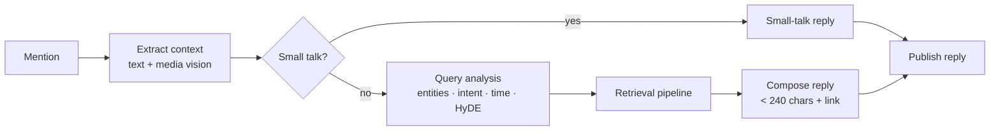
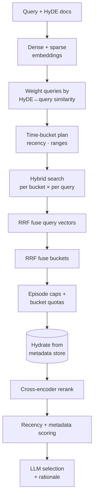

<h1 align="center">Clip'O'pedia 🎧</h1>

<p align="center">
  <em>A mention-driven, hybrid-RAG assistant that listens for questions and replies with the single best podcast clip.</em>
</p>

<p align="center">
  <a href="https://github.com/akira231097/clipopedia/actions/workflows/ci.yml"></a>
  
  
  
</p>

---

Tag the bot under a post — *"what's a good clip on founder burnout?"* — and it
finds the most relevant moment across a large library of podcast episodes and
replies with a link. Under the hood it's a production-shaped Retrieval-Augmented
Generation pipeline: **multimodal context extraction → query understanding →
HyDE → hybrid (dense + sparse) search → reciprocal-rank fusion → cross-encoder
reranking → LLM selection**, orchestrated as a [LangGraph](https://langchain-ai.github.io/langgraph/)
state machine and deployed as a long-running worker.

> **About this project.** Clip'O'pedia is a clean-room **reference
> implementation** I built to demonstrate the architecture of a clip-recommendation
> assistant. It ships with a fully **offline demo** (deterministic fakes, no API
> keys) so you can run the entire pipeline in seconds, plus real adapters for
> OpenAI, Pinecone, Cohere, Gemini, PostgreSQL, AWS SQS/S3, and the X API.

## ⚡ Quickstart (offline, no API keys)

```bash
git clone https://github.com/akira231097/clipopedia.git
cd clipopedia
pip install -e ".[dev]"      # core + dev tooling; no heavy vendor SDKs needed
python -m clipopedia demo    # runs the full pipeline on a synthetic corpus
```

You'll see each query traced through the pipeline — extracted entities, number
of HyDE documents, the chosen clip, and the scores behind the choice (abridged):

```
──────────── Query: best clip on AI agents and reliability ────────────
cleaned: best clip on AI agents and reliability   small_talk: False   time: none
entities: guests=—  hosts=—  show=—   hyde_docs: 3
  Show          Frontier Notes
  Episode       Dr. Lena Ortiz on ai safety
  Guest         Dr. Lena Ortiz
  Rerank score  0.083
  Final score   0.104          (rerank × recency boost)
  Stage         all
  Why           Top-ranked clip; best lexical and semantic match for the request.
Excerpt: The risk with autonomous agents isn't a dramatic rogue AI. It's a boring
one that confidently does the wrong thing at scale because nobody put a human in
the loop on the irreversible actions.
```

Try your own: `python -m clipopedia demo --query "how should I price my startup"`.

## 🧠 How it works



The **retrieval pipeline** (the interesting part) expands one query into many
searches and fuses the results:



Each technique and why it's there is documented in
**[docs/RAG_PIPELINE.md](docs/RAG_PIPELINE.md)**; the component/deployment view
is in **[docs/ARCHITECTURE.md](docs/ARCHITECTURE.md)**.

### Highlights

| Technique | What it buys us |
|---|---|
| **HyDE** | Embeds *hypothetical answers*, not just the terse query, so vectors land near real relevant chunks. |
| **Hybrid search** | Dense embeddings catch meaning; sparse/BM25 catches exact names and jargon. Fused with a tunable `alpha`. |
| **Reciprocal Rank Fusion** | Combines many ranked lists (per HyDE doc, per time bucket) robustly, using rank not raw score. |
| **Time-bucket planning** | A dedicated recency bucket guarantees fresh results when the user asks for "latest". |
| **Cross-encoder rerank** | A reranker re-scores the shortlist with full query↔passage attention. |
| **LLM selection** | A final model picks the single best clip and explains why, across relevance/depth/completeness axes. |
| **Diversity caps** | Per-episode caps stop one episode from dominating the results. |
| **Fuzzy gazetteer** | Reconciles "lena ortiz" / "the long game show" to canonical catalog names before filtering. |

## 🏗️ Design: ports & adapters

The pipeline depends only on a set of `Protocol` interfaces in
[`ports.py`](src/clipopedia/ports.py) — `Embedder`, `VectorStore`, `Reranker`,
`LanguageModel`, `MessageSource`, `SocialClient`, and friends. Two adapter
families implement them:

- **In-memory fakes** ([`adapters/memory.py`](src/clipopedia/adapters/memory.py)) —
  deterministic, no network. They power the demo and the test suite.
- **Live adapters** — OpenAI, Pinecone, Cohere, Gemini, PostgreSQL, AWS SQS/S3,
  Tweepy.

Choosing a backend is a single switch in [`factory.py`](src/clipopedia/factory.py)
driven by `CLIPOPEDIA_BACKEND` — no pipeline code changes. That's what makes the
whole system runnable offline *and* testable without mocking vendor SDKs.

## 📁 Project structure

```
src/clipopedia/
├── config.py            # env-driven settings (pydantic-settings)
├── models.py            # provider-agnostic domain models (pydantic)
├── ports.py             # the Protocol interfaces everything depends on
├── factory.py           # composition root: wires demo vs live backends
├── bot.py               # poll → run graph → ack loop
├── cli.py               # `clipopedia demo` / `clipopedia run`
├── jsonparse.py         # tolerant JSON extraction for LLM output
├── dateutils.py         # date ↔ YYYYMMDD helpers
├── textutils.py         # tokenisation for the offline fakes
├── retrieval/           # the RAG pipeline
│   ├── pipeline.py      #   orchestrates the whole retrieval flow
│   ├── query_analysis.py#   LLM entity/intent/time/HyDE extraction
│   ├── hyde.py          #   HyDE similarity weighting
│   ├── fusion.py        #   reciprocal rank fusion
│   ├── time_planning.py #   query → weighted time buckets
│   ├── scoring.py       #   recency boost, diversity caps, signal scoring
│   ├── selection.py     #   final LLM clip selection
│   └── gazetteer.py     #   fuzzy entity resolution
├── orchestration/       # LangGraph state, nodes, graph
├── adapters/            # memory fakes + real service adapters
└── demo/                # synthetic corpus + runnable example
```

## 🔌 Running against real services

```bash
pip install -e ".[live,dev]"   # adds OpenAI / Pinecone / Cohere / langgraph / boto3 / …
cp .env.example .env           # fill in your own keys; .env is git-ignored
# set CLIPOPEDIA_BACKEND=live in .env
python -m clipopedia run       # polls the queue and replies to mentions
```

See [.env.example](.env.example) for every configuration knob and
[deploy/](deploy/) for an AWS ECS Fargate task-definition template.

## ✅ Tests & quality

```bash
pytest          # unit + end-to-end tests on the in-memory backend
ruff check .    # lint
mypy src        # types
```

CI runs the suite on Python 3.11 and 3.12 and smoke-tests the demo on every push.

## 📜 License

[MIT](LICENSE) — use it, learn from it, build on it.
