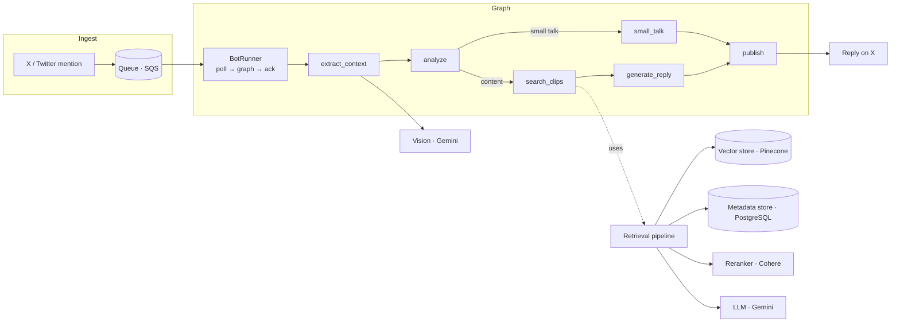
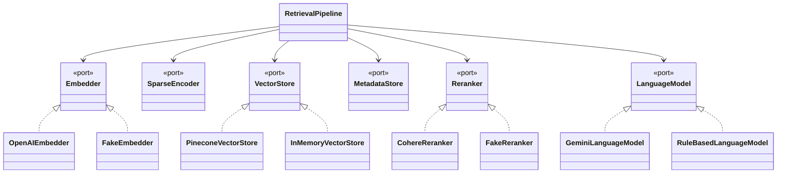

# Architecture

Clip'O'pedia is a single stateless worker that turns inbound social mentions into
podcast-clip recommendations. This document covers the runtime shape, the
component boundaries, and the design decisions behind them.

## Runtime flow

A producer (outside this repo) drops a JSON message per mention onto a queue. The
worker polls it, runs each mention through a [LangGraph](https://langchain-ai.github.io/langgraph/)
state machine, and replies.

The message is **acknowledged only after a reply is successfully published**, so
transient failures are retried rather than silently dropped.

## Component boundaries (ports & adapters)

The core depends on abstract `Protocol`s, never on a vendor SDK:

`factory.py` is the single **composition root** — the only module that imports
concrete adapters. `CLIPOPEDIA_BACKEND=demo|live` picks which family to wire.

### Why this matters
- **Runnable offline.** The whole pipeline runs with deterministic fakes — no
  keys, no network — which is what powers `clipopedia demo`.
- **Testable without mocks.** Tests use the real fakes, not patched SDKs, so they
  exercise actual code paths.
- **Swappable infra.** Replacing Pinecone with another vector DB is one new
  adapter and one line in the factory.

## Concurrency

I/O-bound work is `async`. Within a query, the original and all HyDE embeddings
are generated concurrently, and each time bucket fans its per-query searches out
with `asyncio.gather`. Synchronous vendor SDKs are wrapped with
`asyncio.to_thread` so they don't block the event loop.

## Configuration & secrets

All configuration is environment-driven via `pydantic-settings`
([`config.py`](../src/clipopedia/config.py)). Secrets are **never** hard-coded:
locally they come from a git-ignored `.env`; in production they are injected from
AWS Secrets Manager (see [deploy/](../deploy/)). The committed `.env.example`
contains placeholders only.

## Deployment

The worker holds no local state, so it deploys as a container on any scheduler.
The included template targets **AWS ECS Fargate**: non-secret config as task
environment variables, secrets as `valueFrom` Secrets Manager ARNs, logs to
CloudWatch. Scale by running more tasks against the same queue.

## Failure handling

| Failure | Behaviour |
|---|---|
| LLM analysis/selection error | Caught; pipeline falls back to a sane default (raw query / top reranked clip). |
| Entity filter returns nothing | Automatic unfiltered "safety recall" search. |
| Publish rate-limited / forbidden | Classified; message left on the queue for retry. |
| Unexpected error in loop | Logged; loop continues to the next message. |
