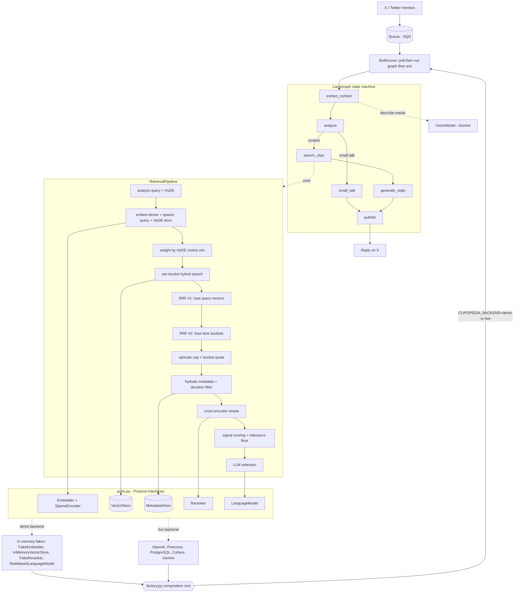

# Clip'O'pedia — Design Notes

Clip'O'pedia is a mention-driven, hybrid-RAG assistant: tag it under a social
post with a question and it replies with the single most relevant podcast clip.
This document explains two design choices that make the codebase interesting —
the **hexagonal ports-and-adapters seam** that lets the entire retrieval
pipeline run fully offline and deterministically, and the **double reciprocal
rank fusion** at the core of retrieval.

## Hexagonal architecture: one pipeline, two worlds

**The problem.** A production RAG pipeline talks to half a dozen paid, networked,
non-deterministic services: OpenAI for dense embeddings, Pinecone for hybrid
vector search, Cohere for reranking, Gemini for analysis/selection/vision,
PostgreSQL for clip metadata, and AWS SQS/S3 for ingestion and media. If the
orchestration logic imports those SDKs directly, the project becomes impossible
to run without a wallet full of API keys, and its tests degrade into a pile of
mocks that assert against patched SDK calls rather than real behavior.

**The approach.** Every capability the pipeline needs is expressed as a
`typing.Protocol` in [`ports.py`](../src/clipopedia/ports.py): `Embedder`,
`SparseEncoder`, `VectorStore`, `MetadataStore`, `Reranker`, `LanguageModel`,
`VisionModel`, `MessageSource`, `SocialClient`, `MediaStore`. The retrieval and
orchestration layers depend *only* on these abstract types — there is not a
single `import openai` or `import pinecone` anywhere in `retrieval/` or
`orchestration/`. Two adapter families implement the ports. The live family
([`adapters/`](../src/clipopedia/adapters/)) wraps the real SDKs and bridges
their synchronous calls onto the event loop with `asyncio.to_thread`. The demo
family ([`adapters/memory.py`](../src/clipopedia/adapters/memory.py)) is a set of
deterministic in-process fakes.

[`factory.py`](../src/clipopedia/factory.py) is the single **composition root** —
the only module that imports concrete adapters at all. `build_demo_backend`
wires the fakes; `build_live_backend` wires the real services; `build_backend`
picks between them based on one environment variable, `CLIPOPEDIA_BACKEND`.
Because the wiring is the only thing that changes, swapping the entire backend
from offline fakes to real infrastructure touches zero lines of pipeline code.

**The pay-off — a fully offline, deterministic pipeline.** The fakes are not
trivial stubs that return canned data; they are faithful enough to exercise the
*real* code paths. `FakeEmbedder` hashes tokens into a fixed-dimension vector so
that texts sharing vocabulary land close in cosine space. `InMemoryVectorStore`
does genuine hybrid `dotproduct` scoring with metadata filtering, mirroring how
Pinecone blends `dense × alpha` and `sparse × (1 − alpha)`. `FakeReranker` is a
Jaccard cross-encoder; `RuleBasedLanguageModel` emits valid JSON for both the
analysis and selection prompts. The result: `python -m clipopedia demo` runs the
entire pipeline — analysis, HyDE, hybrid search, double fusion, diversity caps,
rerank, scoring, selection — in seconds with no network and no credentials, and
the test suite uses these same fakes instead of patched SDKs, so tests verify
actual behavior.

**The trade-off.** The fakes are an approximation, not a simulator. They prove
the pipeline is *wired correctly* and that every stage handles real data shapes,
but they cannot reproduce the *quality* of GPT-class embeddings or a true
cross-encoder. Offline determinism guarantees the plumbing, not the relevance
numbers — relevance has to be validated against the live backend.

## Double reciprocal rank fusion

**The problem.** A single query produces many candidate rankings that must be
merged. HyDE means we search with the original query *plus* several hypothetical
answer documents, each yielding its own ranked list. Time-bucket planning means a
"lately" query is split into a pure-recency bucket, a recent-semantic bucket, and
a low-weight global backstop — each, again, its own ranking. These lists have
wildly different and incomparable score distributions: dense cosine, sparse BM25,
and per-HyDE scores do not live on the same scale, so you cannot just add raw
scores.

**The approach.** [`fusion.py`](../src/clipopedia/retrieval/fusion.py) implements
weighted **Reciprocal Rank Fusion**, which combines lists by *rank* rather than
score: `score(item) = Σ_lists weight_list / (k + rank_in_list)`. Because only
ordinal position matters, RRF is immune to mismatched score scales. The pipeline
([`pipeline.py`](../src/clipopedia/retrieval/pipeline.py)) applies it **twice**.
The *inner* fusion merges the per-query-vector lists *within* one time bucket,
weighted by the HyDE weights — so the original query (largest weight) dominates
and each hypothetical contributes in proportion to its cosine similarity to the
original (computed in [`hyde.py`](../src/clipopedia/retrieval/hyde.py)). The
*outer* fusion then merges the per-bucket results, weighted by each bucket's
planned weight, so recency and relevance are reconciled by rank rather than by a
single compromised ranking.

**The trade-off.** RRF deliberately discards score magnitude. Two clips ranked #1
and #2 in a list are treated as one rank apart regardless of whether the gap in
true relevance was a hair or a chasm. That robustness to scale is exactly what we
want for *fusion*, but it would be wrong as a *final* ordering — which is why
fusion only produces the rerank shortlist. The Cohere cross-encoder then re-scores
with full query-passage attention, and explainable multiplicative recency and
metadata-agreement boosts plus a relevance floor produce the order the LLM
selector finally sees. Fuse by rank to be robust; rerank by score to be precise.